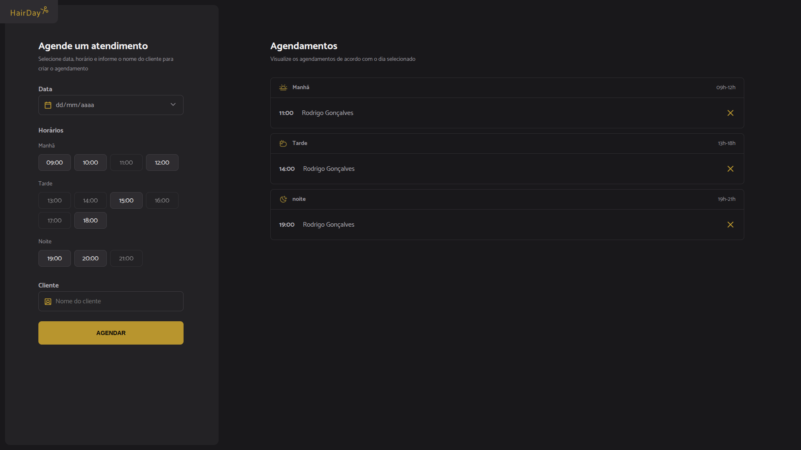

# 💇‍♂️ Agendamento de Cabelo - Projeto JavaScript

Este é um projeto simples de agendamento de horários para um salão de cabeleireiro, feito com JavaScript, HTML e CSS puro.

---

## ✂️ Funcionalidades

- Cadastro de nome e horário do cliente
- Validação de horários disponíveis
- Listagem de agendamentos feitos
- Interface simples e responsiva

---

## 🚀 Tecnologias Utilizadas

- HTML5
- CSS3
- JavaScript (Vanilla JS)

---

## 📁 Estrutura de Pastas

```
projeto-agendamento/
├── index.html
├── style.css
├── script.js
├── README.md
```

---

## 🛠️ Como Usar

1. Clone este repositório:
   ```bash
   git clone https://github.com/CharlesThomaz/hairday-template
   ```

2. Navegue até o diretório:
   ```bash
   cd projeto-agendamento
   ```

3. Abra o arquivo `index.html` no navegador:
   - Clique duas vezes no arquivo, ou
   - Use uma extensão de servidor local como o Live Server (VS Code)

---

## 📷 Exemplo da Tela



---

## 🧑‍💻 Autor

**Charles Thomaz**  
📧 charlesthomaz87@gmail.com  
📞 +55 31 98121-6718  
🔗 [LinkedIn](https://www.linkedin.com/in/charles-thomaz-2b667225b/)

---

## 📝 Licença

Este projeto está licenciado sob a Licença MIT. Veja o arquivo `LICENSE` para mais detalhes.
